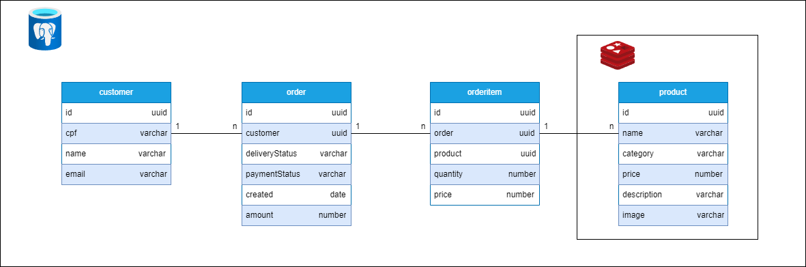
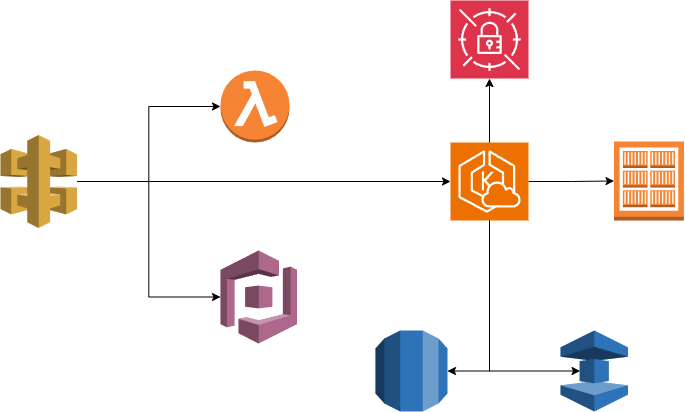

# Tech Challenge - 3

## Introdução
Este projeto foi desenvolvido como parte do curso de pós-graduação em Arquitetura de Software, visando a implementação de práticas modernas de desenvolvimento e operações.

## Arquitetura do Software
A documentação detalhada da arquitetura do software e das APIs disponíveis pode ser encontrada [aqui](https://gitlab.com/ed-wantuil/tech-challenge-clean-architecture).

## Banco de Dados
Optamos pelo PostgreSQL devido à sua estabilidade e rica funcionalidade para gerenciar dados relacionais. O esquema inclui quatro tabelas principais:
- `customer`: Armazena informações dos clientes.
- `order`: Registra os pedidos feitos pelos clientes.
- `orderItem`: Detalha os itens de cada pedido.
- `product`: Contém informações sobre os produtos disponíveis.

> **Nota:** Utilizamos o Redis para caching, especialmente para a tabela de produtos, a fim de otimizar a performance devido ao alto volume de consultas.

## Infraestrutura AWS
A aplicação é hospedada na AWS, utilizando serviços escaláveis e seguros para a publicação:

- **API Gateway**: Ponto de entrada para as APIs, integrado com o Amazon Cognito para segurança.
- **Cognito**: Gerenciamento de autenticação e autorização de usuários.
- **Lambda**: Funções para autenticação de usuários e gerenciamento de contas.
- **ECR**: Registro de Docker para armazenamento e gerenciamento de imagens de container.
- **EKS**: Serviço gerenciado de Kubernetes para a orquestração de containers.
- **Secrets Manager**: Gestão segura das credenciais utilizadas pela aplicação.
- **RDS Postgres**: Banco de dados relacional para armazenamento e gestão de dados.
- **ElastiCache for Redis**: Armazenamento em cache na memória para melhoria de performance.

Os scripts Terraform para provisionamento da infraestrutura estão disponíveis nos seguintes repositórios:
- [API Gateway Terraform](https://github.com/ed-wantuil/tech-challenge-tf-api-gateway)
- [Kubernetes Terraform](https://github.com/ed-wantuil/tech-challenge-tf-k8s)
- [Database Terraform](https://github.com/ed-wantuil/tech-challenge-tf-db)

## Fluxo de Trabalho (Git Flow)
Adotamos o Git Flow para uma organização eficaz do desenvolvimento:

- **Master/Main**: Contém o código de produção.
- **Develop**: Base para o desenvolvimento de novas funcionalidades.
- **Feature Branches**: Desenvolvimento de novas funcionalidades em branches isoladas.
- **Release Branches**: Preparação de novas versões para lançamento.
- **Hotfix Branches**: Correções de bugs críticos em produção.

> **Importante**: Os merges são realizados através de Pull Requests, exigindo duas aprovações e a passagem bem-sucedida por testes unitários, testes integrados e análise do SonarQube.

## CI/CD Pipeline
O pipeline de CI/CD é ativado automaticamente após merges na branch principal, incluindo:

- **Build with Gradle**: Compilação do projeto com Gradle.
- **Run unit tests**: Execução de testes unitários.
- **Run integration tests**: Execução de testes de integração.
- **Run data migration**: Gerenciamento de migrações de dados.
- **Build Docker image**: Construção de imagem Docker do aplicativo.
- **Publish Docker image to Amazon ECR**: Publicação da imagem no ECR.
- **Deploy to Kubernetes**: Implementação no Kubernetes.
